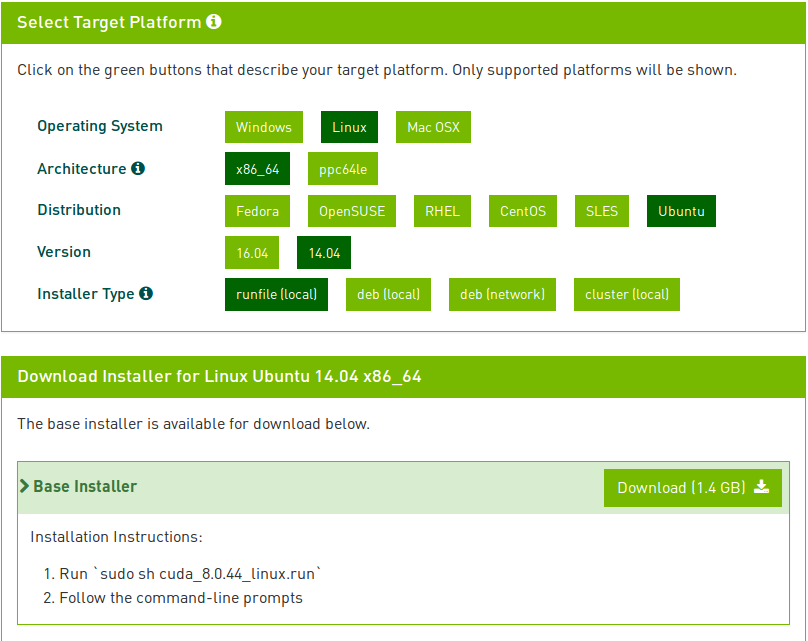

# How to install cuda on your PC

## Download cuda
[raw link](https://developer.nvidia.com/cuda-downloads) chose your Operating System Architecture
Distribution Version and Installer Type like this 


## Install
Follow the prompt message to install
Only supported platforms will be shown
I recommended you use runfile to install cuda, else countless pits ahead

### runfile 
1. `sudo sh cuda_8.0.44_linux.run`
2. Follow the command-line prompts

>NOTE: 
> * You show be install the nvidia driver first. Use cuda to install the driver may cause failure
> Install NVIDIA Accelerated Graphics Driver for Linux-x86_64 361.62?\
>(y)es/(n)o/(q)uit: **n**
### deb package
```
sudo dpkg -i cuda-repo-ubuntu1404-8-0-local_8.044-1.deb
sudo apt-get update
sudo apt-get install cuda
```
## Setting Environment variable
Add below to ~/.bashrc
```
export PATH=/usr/local/cuda:$PATH
export LD_LIBRARY_PATH=/usr/local/cuda-8.0/lib64${LD_LIBRARY_PATH:+:${LD_LIBRARY_PATH}}
```
then execute
`source ~/.bashrc`

## Here is [good](http://www.52nlp.cn/%E6%B7%B1%E5%BA%A6%E5%AD%A6%E4%B9%A0%E4%B8%BB%E6%9C%BA%E7%8E%AF%E5%A2%83%E9%85%8D%E7%BD%AE-ubuntu-16-04-nvidia-gtx-1080-cuda-8) 
