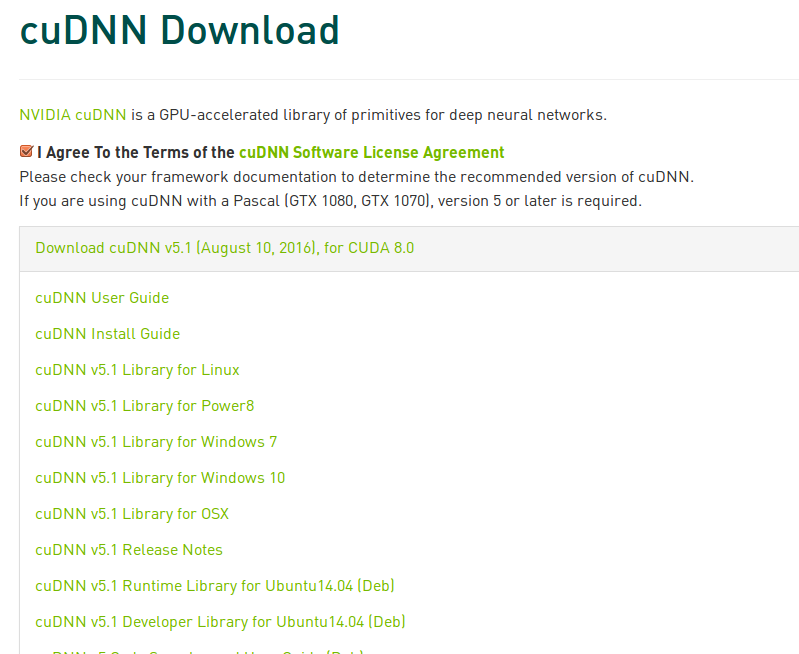

# Install cudnn
Install cudnn is simple [download](https://developer.nvidia.com/cudnn) the file and copy to the target folder

## Download
Download need you to register  
The download page like this 
Chose `cuDNN v5.1 Library for Linux` and right click`Save Link as ...`

## Install
```
tar -xf cudnn-8.0-linux-x64-v5.1.tgz
sudo cp cudnn/include/* /usr/local/cuda/include/
sudo cp cudnn/lib64/*   /usr/local/cuda/lib64/
```
complete

